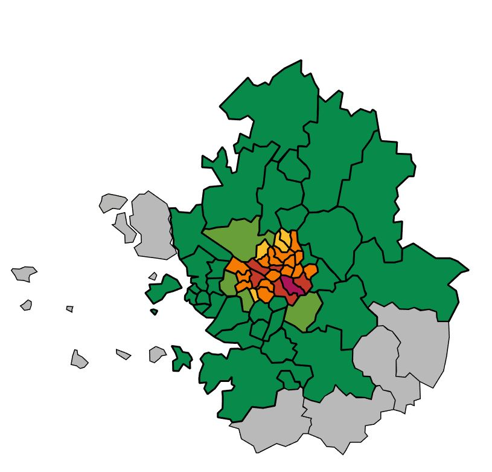

# seoulMap

서울시 택시데이터와 한국 지도(svg파일)을 이용한 히트맵 표현

서울 택시 데이터 : http://data.seoul.go.kr/dataList/datasetView.do?infId=OA-12066&srvType=F&serviceKind=1

실행 방법
---------------------
1. southKorea.py 코드를 실행 
2. 나오는 출력 결과 내용을 메모장에 복사하고 {이름}.svg 파일로 저장 후 실행
  
  
  **P.S. 한글 인코딩 관련 에러는 결과 내용 상단의 인코딩 값을 'euc-kr'로 변경**

이미지 예시
---------------------

***made by Kim Tae-su***
