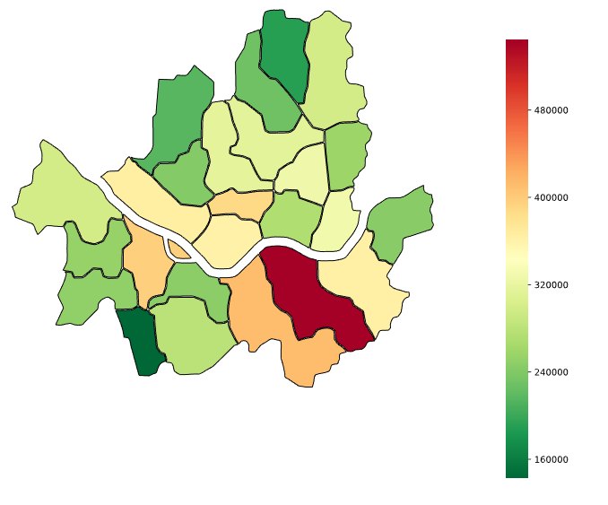

# seoulMap

서울시 택시데이터와 한국 지도(svg파일)을 이용한 히트맵 표현

구역별 택시차량 수에 따른 heatmap

데이터
----------------------
서울 택시 데이터 : http://data.seoul.go.kr/dataList/datasetView.do?infId=OA-12066&srvType=F&serviceKind=1

**P.S. 택시 데이터는 scala를 통해 자료를 가공했습니다.

과정
---------------------
1. mongoDB에서 가져온 서울 택시 데이터 결과(json)를 read 한다.
2. read한 데이터를 토대로 dataframe을 생성하고 seaborn을 이용해 heatmap을 생성
3. 2번 결과에서 각 구별 색깔을 seoul map파일(svg)에 색깔을 입힌다.
4. 색깔 입힌 seoul map 결과와 heat map 결과물을 합친다.
5. 합친 결과물 svg파일로 저장

이미지 예시
---------------------

